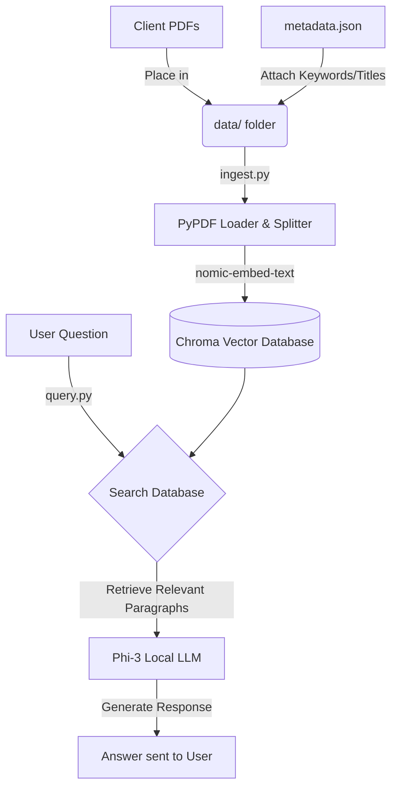

# Local RAG Bot: UPSC IT Wing

## Project Overview
This project is a localized AI assistant designed to answer questions about the UPSC IT Wing and NIC cybersecurity guidelines. It reads documents (PDFs), remembers their contents, and allows you to chat with a local AI model in simple English to extract answers. 

Because the system runs completely offline, no sensitive government data is ever sent to the internet.

## Architecture and Data Flow

The following diagram illustrates how documents are processed and how the chatbot answers questions:

## End-to-End Pipeline Lifecycle
The lifecycle of this system operates in three main stages:

1. **Document Preparation**: We gather PDF documents and a structured list of information (metadata) describing what those documents are about.
2. **Ingestion (Reading and Memorizing)**: The system reads the PDFs, breaks them into small paragraphs, and translates them into a mathematical format (called embeddings). These are saved in the local vector database.
3. **Querying (Asking Questions)**: When you type a question, the system searches the database for the most relevant paragraphs. It then hands those paragraphs to the AI, which reads them and types back a helpful answer.

## Answering Core Concepts

### 1. Structured Database with PDF Library Available
We organize our documents using a simple structured database file called `metadata.json`. This file acts like a library catalog. It stores the title, date, and important keywords for every PDF document in our `data/` folder. When the system reads the PDFs, it attaches this structured catalog information to the text, ensuring the AI knows the exact context of the files it is reading.

### 2. Using Metadata and PDFs with a Local Model (RAG)
RAG stands for Retrieval-Augmented Generation. 
Instead of relying on the AI's general internet knowledge, we "Retrieve" the specific PDFs and metadata we saved. We "Augment" or provide that specific text to our local AI model (Phi-3). The AI then "Generates" a simple English response based strictly on the provided documents. 

### 3. How This is Achieved
This entire process is automated using Python scripts:
- **`ingest.py`**: The script that loads your PDFs, reads the `metadata.json`, and builds the local database (`chroma_db`).
- **`query.py`**: The chat interface. Running this script starts a continuous conversation where you can ask questions, and the system handles searching the database and generating the final answer.

## Setup Instructions

### Prerequisites
- Python installed on your computer.
- Ollama installed and running.
- The `phi3` and `nomic-embed-text` models pulled via Ollama.

### Running the System
1. Open your terminal or command prompt.
2. Ensure you have the required packages installed: `pip install langchain langchain-community chromadb pypdf`.
3. Put your PDFs in the `data/` folder and update `data/metadata.json` with their details.
4. Run the ingestion script: `python ingest.py`.
5. Start chatting: `python query.py`.
