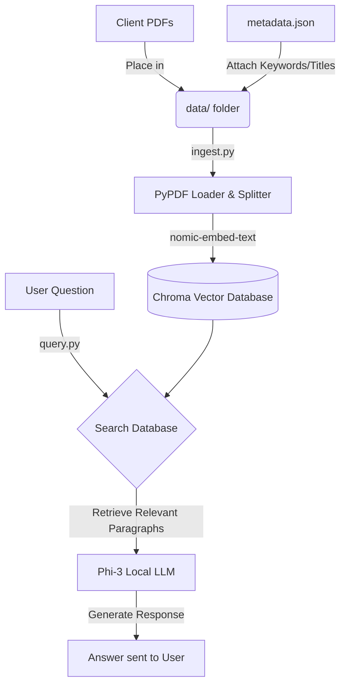
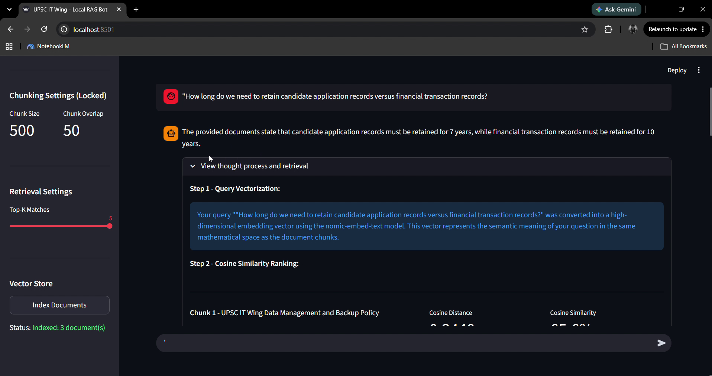
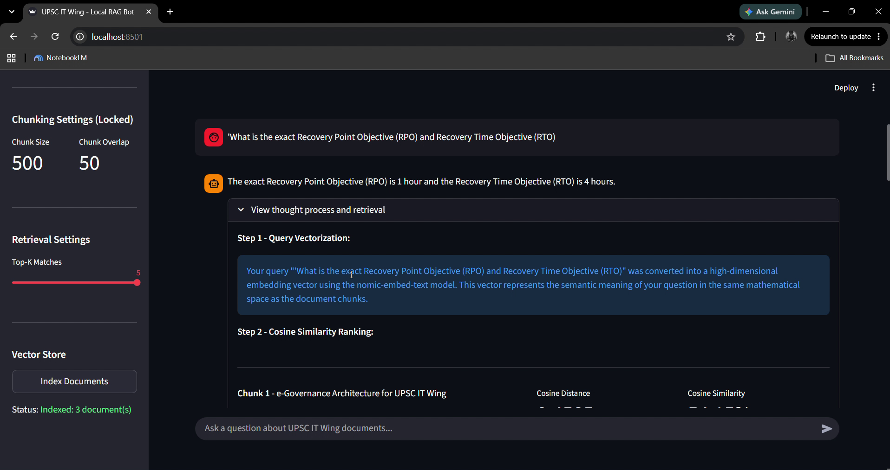
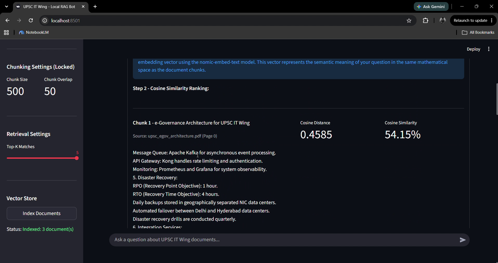

# Local RAG Bot: UPSC IT Wing

## Project Overview
This project is a localized AI assistant designed to answer questions about the UPSC IT Wing and NIC cybersecurity guidelines. It reads documents (PDFs), remembers their contents, and allows you to chat with a local AI model in simple English to extract answers. 

Because the system runs completely offline, no sensitive government data is ever sent to the internet.

**GitHub Repository:** [https://github.com/abhinavsricharan/local-rag-bot](https://github.com/abhinavsricharan/local-rag-bot)

## Architecture and Data Flow

The following diagram illustrates how documents are processed and how the chatbot answers questions:



## End-to-End Pipeline Lifecycle
The lifecycle of this system operates in three main stages (for a deep dive into edge cases, chunking overlap strategies, and embedding math, see [Evaluation and Strategy](Eval.md)):

1. **Document Preparation**: We gather PDF documents and a structured list of information (metadata) describing what those documents are about.
2. **Ingestion (Reading and Memorizing)**: The system reads the PDFs, breaks them into small paragraphs, and translates them into a mathematical format (called embeddings). These are saved in the local vector database (see [Data Overview](data/README.md) and [Chroma DB Schema](data/CHROMA_DB_SCHEMA.md)).
3. **Querying (Asking Questions)**: When you type a question, the system searches the database for the most relevant paragraphs. It then hands those paragraphs to the AI, which reads them and types back a helpful answer.

## Answering Core Concepts

### 1. Structured Database with PDF Library Available
We organize our documents using a simple structured database file called [`metadata.json`](data/metadata.json). This file acts like a library catalog. It stores the title, date, and important keywords for every PDF document in our [`data/`](data/) folder. When the system reads the PDFs, it attaches this structured catalog information to the text, ensuring the AI knows the exact context of the files it is reading.

### 2. Using Metadata and PDFs with a Local Model (RAG)
RAG stands for Retrieval-Augmented Generation. 
Instead of relying on the AI's general internet knowledge, we "Retrieve" the specific PDFs and metadata we saved. We "Augment" or provide that specific text to our local AI model (Phi-3). The AI then "Generates" a simple English response based strictly on the provided documents. 

### 3. How This is Achieved
This entire process is automated using Python scripts:
- **[`ingest.py`](ingest.py)**: The script that loads your PDFs, reads the [`metadata.json`](data/metadata.json), and builds the local database (`chroma_db` - detailed in [Chroma DB Schema](data/CHROMA_DB_SCHEMA.md)).
- **[`query.py`](query.py)**: The chat interface. Running this script starts a continuous conversation where you can ask questions, and the system handles searching the database and generating the final answer.

## Setup Instructions

### Prerequisites
- Python installed on your computer.
- Ollama installed and running.
- The `phi3` and `nomic-embed-text` models pulled via Ollama.

### Running the System
1. Open your terminal or command prompt.
2. Ensure you have the required packages installed: `pip install -r requirements.txt`.
3. Put your PDFs in the [`data/`](data/) folder and update [`data/metadata.json`](data/metadata.json) with their details.
4. Run the ingestion script: `python ingest.py`.
5. Start chatting via terminal (`python query.py`) or launch the web dashboard (`streamlit run app.py`).

## On-Premises Hosting and Multi-User Deployment
For detailed specifications on deploying this system on private on-premises infrastructure, sizing CPU-only versus GPU hardware, and configuring multi-user concurrency, see the [On-Premises Hosting Guide](hosting.md).

## Web Dashboard Preview and Snapshot Walkthrough

Below are visual captures from the prototype recording (`bot-streamlit-prototype.mp4`) demonstrating the Azure AI Foundry-style dashboard, query grounding, and cosine similarity metric inspection.

### 1. Conversational Query Grounding
The bot synthesizes direct, grounded answers based strictly on the retrieved document context:



### 2. Retrieval Thought Process and Query Vectorization
Expanding the inspection drawer displays the query vectorization breakdown:



### 3. Cosine Similarity Ranking and Source Attribution
Each candidate chunk is displayed with its exact calculated cosine distance, normalized similarity percentage, and document attribution:



## Example Usage

Here are some text snapshot examples of the chatbot in action:

**Example 1: Cybersecurity Policy**
```text
User: What are the cybersecurity guidelines for UPSC portals?
Assistant: The cybersecurity guidelines for UPSC portals, as outlined by NIC, include the following key points:
1. All UPSC web portals must implement TLS 1.3 for encryption.
2. Multi-factor authentication (MFA) is required for all administrative access.
3. Passwords must be a minimum of 14 characters long and changed every 90 days.
4. Annual security audits are necessary for all UPSC IT infrastructure.
5. Security breaches must be reported to the NIC CERT within 24 hours.
```

**Example 2: Infrastructure Architecture**
```text
User: What cloud infrastructure is used to host the UPSC portals?
Assistant: The UPSC portals and applications are hosted on the NIC National Cloud (MeghRaj). The architecture includes auto-scaling groups configured to handle peak loads during exam result declarations.
```

## Disclaimer
The PDF files provided in the [`data/`](data/) folder are mock templates included solely for demonstration and testing purposes. They do not represent official policies, guidelines, or infrastructure of the UPSC, NIC, or any government entity. 

This software is provided "as is", without warranty of any kind, express or implied, including but not limited to the warranties of merchantability, fitness for a particular purpose, and non-infringement. In no event shall the authors or copyright holders be liable for any claim, damages, or other liability arising from, out of, or in connection with the software or the use or other dealings in the software.
